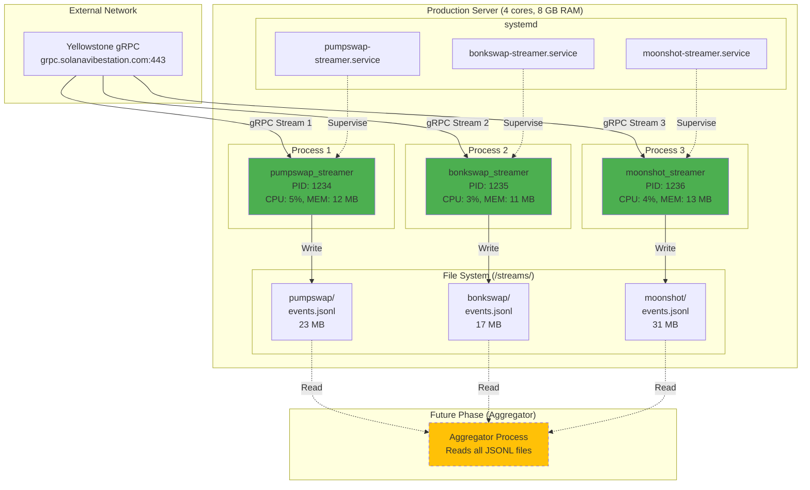
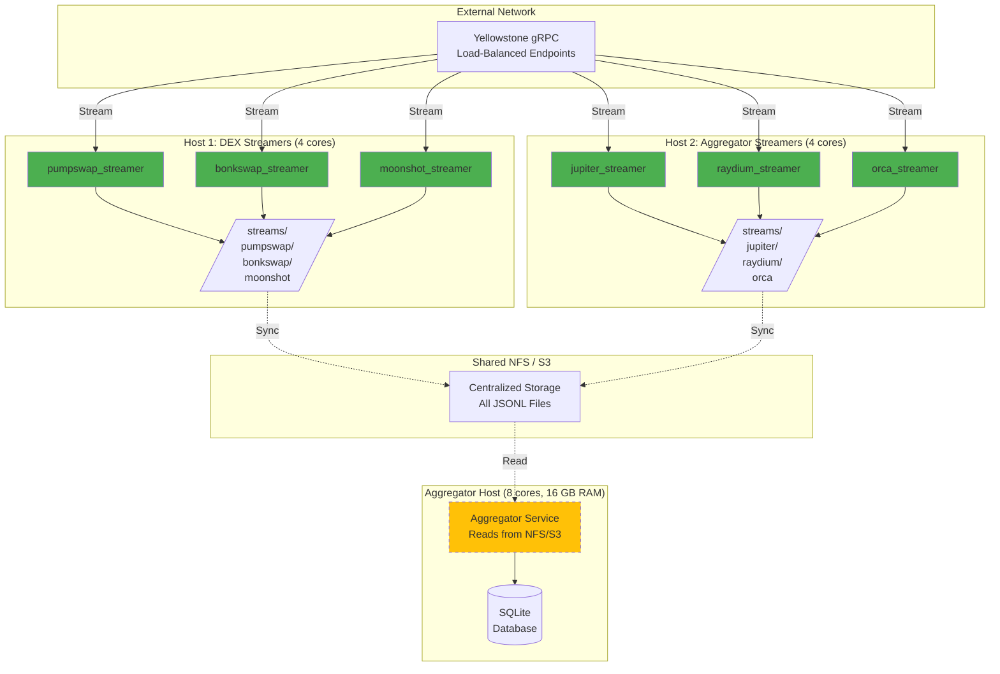

# Run Topology & Deployment Architecture

**Created:** 2025-11-13T08:00  
**Purpose:** Process-level topology and deployment strategies for Multi-Streamer System  
**Audience:** DevOps, SREs, Production Engineers  
**Related Docs:** [architecture-streamer-system.md](./20251113T08-architecture-streamer-system.md)

---

## Table of Contents

1. [Process Topology Diagram](#process-topology-diagram)
2. [Output Directory Structure](#output-directory-structure)
3. [Deployment Options](#deployment-options)
4. [Scaling Strategies](#scaling-strategies)
5. [Supervision & Monitoring](#supervision--monitoring)
6. [Resource Allocation](#resource-allocation)
7. [Production Deployment Guide](#production-deployment-guide)
8. [Disaster Recovery](#disaster-recovery)

---

## Process Topology Diagram

### Single-Machine Deployment



### Multi-Machine Deployment (Horizontal Scaling)



---

## Output Directory Structure

### Recommended Layout

```
/streams/                            ← Base directory (configurable via OUTPUT_BASE_DIR)
├── pumpswap/                        ← Per-program subdirectory
│   ├── events.jsonl                 ← Active file (being written)
│   ├── events.jsonl.1               ← Rotated file (most recent, ~100 MB)
│   ├── events.jsonl.2               ← Rotated file (older)
│   ├── events.jsonl.3
│   ├── ...
│   └── events.jsonl.10              ← Oldest rotation (deleted after next rotation)
├── bonkswap/
│   ├── events.jsonl
│   ├── events.jsonl.1
│   └── ...
├── moonshot/
│   ├── events.jsonl
│   ├── events.jsonl.1
│   └── ...
└── jupiter_dca/                     ← New programs added here
    ├── events.jsonl
    └── ...
```

### File Naming Convention

| File | Purpose | Size | Retention |
|------|---------|------|-----------|
| `events.jsonl` | Active (current writes) | 0-100 MB | Forever (until rotated) |
| `events.jsonl.1` | 1st rotation (most recent) | ~100 MB | Until 11th rotation |
| `events.jsonl.2` | 2nd rotation | ~100 MB | Until 12th rotation |
| ... | ... | ~100 MB | ... |
| `events.jsonl.10` | 10th rotation (oldest) | ~100 MB | Deleted on next rotation |

**Total Storage per Program:**
- Active file: 0-100 MB (average 50 MB)
- 10 rotations: 10 × 100 MB = 1 GB
- **Total: ~1.05 GB per program**

**System-Wide (3 programs):**
- 3 × 1.05 GB = **3.15 GB total** (steady state)

### Disk Usage Monitoring

```bash
# Check total usage
du -sh /streams/

# Per-program breakdown
du -sh /streams/*/

# Detailed view
du -h /streams/*/*.jsonl* | sort -h
```

**Example Output:**

```
23M    /streams/pumpswap/events.jsonl
98M    /streams/pumpswap/events.jsonl.1
100M   /streams/pumpswap/events.jsonl.2
...
1.1G   /streams/pumpswap/
850M   /streams/bonkswap/
1.3G   /streams/moonshot/
3.2G   /streams/
```

### Permissions

**Recommended Setup:**

```bash
# Create base directory
sudo mkdir -p /streams
sudo chown solflow:solflow /streams
sudo chmod 755 /streams

# Create per-program directories
for program in pumpswap bonkswap moonshot; do
    sudo mkdir -p /streams/$program
    sudo chown solflow:solflow /streams/$program
    sudo chmod 755 /streams/$program
done
```

**Security Considerations:**

- Streamer processes run as `solflow` user (not root)
- Write access only to own subdirectory
- Read access for aggregator user (e.g., `aggregator` group)

**ACLs (if using shared access):**

```bash
# Allow aggregator group to read
sudo setfacl -R -m g:aggregator:r-x /streams/
sudo setfacl -R -d -m g:aggregator:r-x /streams/
```

---

## Deployment Options

### Option 1: systemd Services (Recommended for Linux)

**Architecture:**
- One systemd service per streamer
- Automatic restart on failure
- Centralized logging (journalctl)
- Resource limits (MemoryMax, CPUQuota)

**Service Files:**

**File:** `/etc/systemd/system/pumpswap-streamer.service`

```ini
[Unit]
Description=PumpSwap Streamer - SolFlow Multi-Streamer System
Documentation=https://github.com/yourusername/carbon-terminal
After=network-online.target
Wants=network-online.target

[Service]
Type=simple
User=solflow
Group=solflow
WorkingDirectory=/home/solflow/carbon-terminal

# Environment
Environment="RUST_LOG=info"
EnvironmentFile=/home/solflow/carbon-terminal/.env

# Execution
ExecStart=/home/solflow/carbon-terminal/target/release/pumpswap_streamer

# Restart policy
Restart=always
RestartSec=10s
StartLimitInterval=300s
StartLimitBurst=5

# Resource limits
MemoryMax=100M
CPUQuota=20%

# Shutdown behavior
KillMode=mixed
KillSignal=SIGTERM
TimeoutStopSec=10s

# Security hardening
NoNewPrivileges=true
PrivateTmp=true
ProtectSystem=strict
ProtectHome=true
ReadWritePaths=/streams/pumpswap

[Install]
WantedBy=multi-user.target
```

**Deployment Steps:**

```bash
# 1. Copy service files
sudo cp systemd/*.service /etc/systemd/system/

# 2. Reload systemd
sudo systemctl daemon-reload

# 3. Enable services (start on boot)
sudo systemctl enable pumpswap-streamer
sudo systemctl enable bonkswap-streamer
sudo systemctl enable moonshot-streamer

# 4. Start services
sudo systemctl start pumpswap-streamer
sudo systemctl start bonkswap-streamer
sudo systemctl start moonshot-streamer

# 5. Verify status
sudo systemctl status pumpswap-streamer
sudo systemctl status bonkswap-streamer
sudo systemctl status moonshot-streamer
```

**Management Commands:**

```bash
# Start all streamers
sudo systemctl start pumpswap-streamer bonkswap-streamer moonshot-streamer

# Stop all streamers
sudo systemctl stop pumpswap-streamer bonkswap-streamer moonshot-streamer

# Restart specific streamer
sudo systemctl restart pumpswap-streamer

# View logs
sudo journalctl -u pumpswap-streamer -f
sudo journalctl -u pumpswap-streamer --since "1 hour ago"

# Check resource usage
systemctl status pumpswap-streamer | grep Memory
systemctl status pumpswap-streamer | grep CPU
```

---

### Option 2: Docker Compose

**Architecture:**
- Each streamer runs in a container
- Shared volumes for output
- Centralized environment variables
- Easy scaling (docker-compose scale)

**File:** `docker-compose.yml`

```yaml
version: '3.8'

services:
  pumpswap-streamer:
    image: solflow/streamer:${VERSION:-latest}
    container_name: pumpswap-streamer
    command: /app/pumpswap_streamer
    environment:
      - GEYSER_URL=${GEYSER_URL}
      - X_TOKEN=${X_TOKEN}
      - RUST_LOG=${RUST_LOG:-info}
      - COMMITMENT_LEVEL=${COMMITMENT_LEVEL:-Confirmed}
    volumes:
      - ./streams/pumpswap:/streams/pumpswap
      - ./logs:/logs
    restart: unless-stopped
    mem_limit: 100m
    cpus: 0.2
    networks:
      - solflow
    logging:
      driver: json-file
      options:
        max-size: "10m"
        max-file: "3"

  bonkswap-streamer:
    image: solflow/streamer:${VERSION:-latest}
    container_name: bonkswap-streamer
    command: /app/bonkswap_streamer
    environment:
      - GEYSER_URL=${GEYSER_URL}
      - X_TOKEN=${X_TOKEN}
      - RUST_LOG=${RUST_LOG:-info}
    volumes:
      - ./streams/bonkswap:/streams/bonkswap
      - ./logs:/logs
    restart: unless-stopped
    mem_limit: 100m
    cpus: 0.2
    networks:
      - solflow

  moonshot-streamer:
    image: solflow/streamer:${VERSION:-latest}
    container_name: moonshot-streamer
    command: /app/moonshot_streamer
    environment:
      - GEYSER_URL=${GEYSER_URL}
      - X_TOKEN=${X_TOKEN}
      - RUST_LOG=${RUST_LOG:-info}
    volumes:
      - ./streams/moonshot:/streams/moonshot
      - ./logs:/logs
    restart: unless-stopped
    mem_limit: 100m
    cpus: 0.2
    networks:
      - solflow

networks:
  solflow:
    driver: bridge
```

**Dockerfile:**

```dockerfile
FROM rust:1.75-slim as builder

WORKDIR /build
COPY Cargo.toml Cargo.lock ./
COPY src ./src

RUN cargo build --release --bins

FROM debian:bookworm-slim
RUN apt-get update && apt-get install -y ca-certificates && rm -rf /var/lib/apt/lists/*

WORKDIR /app
COPY --from=builder /build/target/release/pumpswap_streamer /app/
COPY --from=builder /build/target/release/bonkswap_streamer /app/
COPY --from=builder /build/target/release/moonshot_streamer /app/

RUN useradd -m -u 1000 solflow && chown -R solflow:solflow /app
USER solflow

CMD ["/app/pumpswap_streamer"]
```

**Deployment Steps:**

```bash
# 1. Build image
docker build -t solflow/streamer:latest .

# 2. Create output directories
mkdir -p streams/{pumpswap,bonkswap,moonshot}

# 3. Start all services
docker-compose up -d

# 4. Verify containers are running
docker-compose ps

# 5. View logs
docker-compose logs -f pumpswap-streamer
docker-compose logs -f bonkswap-streamer
docker-compose logs -f moonshot-streamer
```

**Management Commands:**

```bash
# Start all streamers
docker-compose up -d

# Stop all streamers
docker-compose down

# Restart specific streamer
docker-compose restart pumpswap-streamer

# View logs
docker-compose logs -f pumpswap-streamer

# Check resource usage
docker stats
```

---

### Option 3: Kubernetes (For Large-Scale Deployments)

**Architecture:**
- Each streamer is a Deployment (1 replica)
- Persistent Volumes for output storage
- ConfigMaps for environment variables
- Horizontal Pod Autoscaling (future)

**File:** `k8s/pumpswap-streamer.yaml`

```yaml
apiVersion: apps/v1
kind: Deployment
metadata:
  name: pumpswap-streamer
  namespace: solflow
spec:
  replicas: 1
  selector:
    matchLabels:
      app: pumpswap-streamer
  template:
    metadata:
      labels:
        app: pumpswap-streamer
    spec:
      containers:
      - name: streamer
        image: solflow/streamer:latest
        command: ["/app/pumpswap_streamer"]
        env:
        - name: GEYSER_URL
          valueFrom:
            configMapKeyRef:
              name: streamer-config
              key: geyser_url
        - name: X_TOKEN
          valueFrom:
            secretKeyRef:
              name: streamer-secrets
              key: x_token
        - name: RUST_LOG
          value: "info"
        volumeMounts:
        - name: output
          mountPath: /streams/pumpswap
        resources:
          requests:
            memory: "50Mi"
            cpu: "100m"
          limits:
            memory: "100Mi"
            cpu: "200m"
      volumes:
      - name: output
        persistentVolumeClaim:
          claimName: pumpswap-streamer-pvc
---
apiVersion: v1
kind: PersistentVolumeClaim
metadata:
  name: pumpswap-streamer-pvc
  namespace: solflow
spec:
  accessModes:
  - ReadWriteOnce
  resources:
    requests:
      storage: 5Gi
  storageClassName: fast-ssd
```

**Deployment:**

```bash
# Apply all manifests
kubectl apply -f k8s/

# Verify pods are running
kubectl get pods -n solflow

# View logs
kubectl logs -f deployment/pumpswap-streamer -n solflow

# Check resource usage
kubectl top pods -n solflow
```

---

### Option 4: Supervisor (Simple Alternative to systemd)

**File:** `/etc/supervisor/conf.d/streamers.conf`

```ini
[program:pumpswap-streamer]
command=/home/solflow/carbon-terminal/target/release/pumpswap_streamer
directory=/home/solflow/carbon-terminal
user=solflow
autostart=true
autorestart=true
stderr_logfile=/var/log/supervisor/pumpswap-streamer.err.log
stdout_logfile=/var/log/supervisor/pumpswap-streamer.out.log
environment=GEYSER_URL="%(ENV_GEYSER_URL)s",X_TOKEN="%(ENV_X_TOKEN)s"

[program:bonkswap-streamer]
command=/home/solflow/carbon-terminal/target/release/bonkswap_streamer
directory=/home/solflow/carbon-terminal
user=solflow
autostart=true
autorestart=true
stderr_logfile=/var/log/supervisor/bonkswap-streamer.err.log
stdout_logfile=/var/log/supervisor/bonkswap-streamer.out.log

[program:moonshot-streamer]
command=/home/solflow/carbon-terminal/target/release/moonshot_streamer
directory=/home/solflow/carbon-terminal
user=solflow
autostart=true
autorestart=true
stderr_logfile=/var/log/supervisor/moonshot-streamer.err.log
stdout_logfile=/var/log/supervisor/moonshot-streamer.out.log

[group:streamers]
programs=pumpswap-streamer,bonkswap-streamer,moonshot-streamer
```

**Management:**

```bash
# Reload supervisor config
sudo supervisorctl reread
sudo supervisorctl update

# Start all streamers
sudo supervisorctl start streamers:*

# Stop all streamers
sudo supervisorctl stop streamers:*

# Restart specific streamer
sudo supervisorctl restart streamers:pumpswap-streamer

# View status
sudo supervisorctl status
```

---

## Scaling Strategies

### Vertical Scaling (Single Machine)

**Strategy:** Increase resources (CPU, RAM, disk) on existing machine.

**When to Use:**
- ✅ Total streamers < 10
- ✅ Combined throughput < 500 tx/s
- ✅ Simplicity is priority

**Hardware Recommendations:**

| Streamers | CPU Cores | RAM | Disk | Notes |
|-----------|-----------|-----|------|-------|
| 1-3 | 4 cores | 8 GB | 50 GB SSD | Basic setup (PumpSwap, BonkSwap, Moonshot) |
| 4-6 | 8 cores | 16 GB | 100 GB SSD | Add Jupiter, Raydium, Orca |
| 7-10 | 16 cores | 32 GB | 200 GB SSD | Full DEX coverage |
| 10+ | Switch to horizontal scaling | | | Multi-machine more efficient |

**Cost Estimate (AWS):**

| Instance Type | vCPUs | RAM | Cost/month | Streamers Supported |
|---------------|-------|-----|------------|---------------------|
| t3.medium | 2 | 4 GB | $30 | 1-2 (testing) |
| t3.large | 2 | 8 GB | $60 | 3-4 |
| c6i.2xlarge | 8 | 16 GB | $245 | 6-8 |
| c6i.4xlarge | 16 | 32 GB | $490 | 10-12 |

---

### Horizontal Scaling (Multi-Machine)

**Strategy:** Distribute streamers across multiple machines.

**When to Use:**
- ✅ Total streamers > 10
- ✅ Fault tolerance required (one machine failure = partial outage only)
- ✅ Geographic distribution needed

**Architecture Options:**

**Option A: Sharding by Program Type**

```
Machine 1 (DEX Programs):
- PumpSwap, BonkSwap, Moonshot, Phoenix

Machine 2 (Aggregator Programs):
- Jupiter, Raydium, Orca, Lifinity

Machine 3 (Niche Programs):
- Meteora, Saber, Serum, GooseFX
```

**Option B: Sharding by Load**

```
Machine 1 (High Volume):
- Jupiter (50 tx/s)
- Raydium (40 tx/s)

Machine 2 (Medium Volume):
- PumpSwap (25 tx/s)
- Orca (20 tx/s)

Machine 3 (Low Volume):
- BonkSwap (5 tx/s)
- Moonshot (10 tx/s)
- Phoenix (8 tx/s)
```

**Shared Storage Options:**

| Option | Pros | Cons | Use Case |
|--------|------|------|----------|
| **NFS** | Simple, mature | Single point of failure | Small deployments |
| **S3 / Object Storage** | Scalable, durable | Higher latency | Large deployments |
| **Distributed FS (Ceph)** | Highly available | Complex setup | Enterprise |
| **Per-Machine Local** | Fastest | No central aggregation | With distributed aggregator |

---

### Load Balancing (gRPC Endpoints)

**Strategy:** Distribute load across multiple Yellowstone endpoints.

**Architecture:**

```
Streamer 1 → Endpoint A (us-west-1)
Streamer 2 → Endpoint B (us-east-1)
Streamer 3 → Endpoint A (us-west-1)
Streamer 4 → Endpoint B (us-east-1)
```

**Configuration:**

```bash
# .env.machine1
GEYSER_URL=https://us-west-1.grpc.solanavibestation.com

# .env.machine2
GEYSER_URL=https://us-east-1.grpc.solanavibestation.com
```

**Benefits:**
- ✅ Reduced load per endpoint
- ✅ Geographic redundancy
- ✅ Failover capability

---

## Supervision & Monitoring

### Health Checks

**Liveness Check (Is process running?):**

```bash
# systemd
sudo systemctl is-active pumpswap-streamer
# Output: active or inactive

# Docker
docker ps -q -f name=pumpswap-streamer
# Output: container ID or empty

# Process check
pgrep -f pumpswap_streamer
# Output: PID or empty
```

**Readiness Check (Is process producing output?):**

```bash
# Check file modification time
FILE=/streams/pumpswap/events.jsonl
MTIME=$(stat -c %Y "$FILE")
NOW=$(date +%s)
AGE=$((NOW - MTIME))

if [ $AGE -gt 300 ]; then
    echo "WARN: Output file not modified in 5 minutes"
fi
```

**Data Quality Check (Are events valid?):**

```bash
# Validate last 10 events
tail -10 /streams/pumpswap/events.jsonl | while read line; do
    echo "$line" | jq . > /dev/null || echo "INVALID JSON: $line"
done
```

### Alerting (Prometheus + Alertmanager)

**Metrics Exporter (Future Enhancement):**

```yaml
# Add to streamer_core
use prometheus::{Counter, Gauge, Histogram, register_counter, register_gauge};

lazy_static! {
    static ref TRADES_TOTAL: Counter = register_counter!("trades_total", "Total trades").unwrap();
    static ref OUTPUT_FILE_SIZE: Gauge = register_gauge!("output_file_size_bytes", "Output file size").unwrap();
    static ref PROCESSING_DURATION: Histogram = register_histogram!("processing_duration_seconds", "Processing duration").unwrap();
}
```

**Prometheus Scrape Config:**

```yaml
scrape_configs:
  - job_name: 'streamers'
    static_configs:
      - targets:
        - 'localhost:9090'  # pumpswap-streamer metrics endpoint
        - 'localhost:9091'  # bonkswap-streamer metrics endpoint
        - 'localhost:9092'  # moonshot-streamer metrics endpoint
```

**Alert Rules:**

```yaml
groups:
- name: streamers
  rules:
  - alert: StreamerDown
    expr: up{job="streamers"} == 0
    for: 2m
    labels:
      severity: critical
    annotations:
      summary: "Streamer {{ $labels.instance }} is down"
      
  - alert: NoOutputIncrease
    expr: delta(output_file_size_bytes[5m]) == 0
    for: 10m
    labels:
      severity: warning
    annotations:
      summary: "Streamer {{ $labels.instance }} output file not growing"
```

---

## Resource Allocation

### CPU Allocation

**Per-Streamer (Recommended):**

| Scenario | CPU % (1 core) | Cores Allocated |
|----------|----------------|-----------------|
| Light (5 tx/s) | 2-3% | 0.1 cores |
| Moderate (25 tx/s) | 5-8% | 0.2 cores |
| Heavy (50 tx/s) | 10-15% | 0.3 cores |

**System-Wide (3 streamers, moderate load):**

```
Total CPU: 3 × 0.2 cores = 0.6 cores
Recommendation: 4-core system (leaves headroom for OS + peaks)
```

**CPU Quota (systemd):**

```ini
[Service]
CPUQuota=20%  # Limit to 20% of one core
```

**CPU Quota (Docker):**

```yaml
services:
  pumpswap-streamer:
    cpus: 0.2  # 20% of one core
```

---

### Memory Allocation

**Per-Streamer (Observed):**

| Component | Steady State | Peak | Notes |
|-----------|--------------|------|-------|
| Binary .text | 2 MB | N/A | Code segment |
| Stack | 2 MB | 2 MB | Tokio default |
| gRPC buffers | 5-8 MB | 15 MB | In-flight TXs |
| Heap | 2-3 MB | 5 MB | Config, strings |
| **Total** | **~12 MB** | **~25 MB** | |

**System-Wide (3 streamers):**

```
Steady state: 3 × 12 MB = 36 MB
Peak: 3 × 25 MB = 75 MB
Recommendation: 8 GB system (massive headroom)
```

**Memory Limit (systemd):**

```ini
[Service]
MemoryMax=100M  # Hard limit (OOM kill if exceeded)
MemoryHigh=80M  # Soft limit (throttle if exceeded)
```

**Memory Limit (Docker):**

```yaml
services:
  pumpswap-streamer:
    mem_limit: 100m
    mem_reservation: 50m
```

---

### Disk I/O

**Write Throughput (Per-Streamer):**

```
Event size: ~400 bytes
Events/sec: 50 (moderate load)
Write rate: 20 KB/s
Daily volume: 1.7 GB
```

**System-Wide (3 streamers):**

```
Write rate: 60 KB/s
Daily volume: 5.1 GB
Weekly volume: 36 GB
Monthly volume: 153 GB
```

**Disk Requirements:**

| Deployment | Recommended Disk | Notes |
|------------|------------------|-------|
| Testing | 10 GB | 1 week retention |
| Staging | 50 GB | 1 month retention |
| Production | 200 GB | 1 year retention + headroom |

**IOPS Requirements:**

```
Write IOPS: ~100 IOPS (buffered writes, not intensive)
Recommendation: Standard SSD (1000 IOPS+) is overkill, even HDD works
```

---

## Production Deployment Guide

### Pre-Deployment Checklist

**Infrastructure:**

- [ ] Server provisioned (4 cores, 8 GB RAM, 50 GB SSD minimum)
- [ ] Firewall configured (allow outbound 443 to Yellowstone gRPC)
- [ ] DNS resolution working (`nslookup grpc.solanavibestation.com`)
- [ ] NTP synchronized (`timedatectl status`)

**Software:**

- [ ] Rust 1.75+ installed (`rustc --version`)
- [ ] Binary compiled for production (`cargo build --release`)
- [ ] Binary tested locally (run for 5 minutes, verify output)
- [ ] systemd service files created (or Docker Compose)

**Configuration:**

- [ ] `.env` file created with valid credentials
- [ ] `GEYSER_URL` verified (test with grpcurl)
- [ ] `X_TOKEN` verified (test authentication)
- [ ] Output directories created (`/streams/pumpswap`, etc.)
- [ ] Permissions set (`chown solflow:solflow /streams/`)

**Monitoring:**

- [ ] Log aggregation configured (journalctl or Docker logs)
- [ ] Alerting rules defined (Prometheus or PagerDuty)
- [ ] Health check scripts deployed

---

### Deployment Steps (systemd)

**Step 1: Deploy Binary**

```bash
# Copy binary to production server
scp target/release/pumpswap_streamer solflow@prod:/home/solflow/bin/
scp target/release/bonkswap_streamer solflow@prod:/home/solflow/bin/
scp target/release/moonshot_streamer solflow@prod:/home/solflow/bin/

# Verify
ssh solflow@prod 'ls -lh ~/bin/*_streamer'
```

**Step 2: Deploy Configuration**

```bash
# Copy .env file (secure transfer!)
scp .env solflow@prod:/home/solflow/.env

# Verify (check no secrets in logs!)
ssh solflow@prod 'grep GEYSER_URL ~/.env'  # Should show URL
ssh solflow@prod 'grep X_TOKEN ~/.env | wc -c'  # Should show length, not value
```

**Step 3: Deploy systemd Services**

```bash
# Copy service files
scp systemd/*.service solflow@prod:/tmp/
ssh solflow@prod 'sudo mv /tmp/*.service /etc/systemd/system/'

# Reload systemd
ssh solflow@prod 'sudo systemctl daemon-reload'
```

**Step 4: Enable and Start Services**

```bash
ssh solflow@prod << 'EOF'
  # Enable (start on boot)
  sudo systemctl enable pumpswap-streamer
  sudo systemctl enable bonkswap-streamer
  sudo systemctl enable moonshot-streamer
  
  # Start services
  sudo systemctl start pumpswap-streamer
  sudo systemctl start bonkswap-streamer
  sudo systemctl start moonshot-streamer
  
  # Verify
  sudo systemctl status pumpswap-streamer
  sudo systemctl status bonkswap-streamer
  sudo systemctl status moonshot-streamer
EOF
```

**Step 5: Verify Output**

```bash
# Wait 30 seconds for output
sleep 30

# Check output files
ssh solflow@prod 'ls -lh /streams/*/events.jsonl'

# Verify JSON validity
ssh solflow@prod 'tail -1 /streams/pumpswap/events.jsonl | jq .'
```

**Step 6: Monitor for 24 Hours**

```bash
# Set up continuous monitoring
watch -n 60 'ssh solflow@prod "systemctl status pumpswap-streamer bonkswap-streamer moonshot-streamer"'

# Check logs periodically
ssh solflow@prod 'journalctl -u pumpswap-streamer --since "1 hour ago" | grep -i error'
```

---

## Disaster Recovery

### Backup Strategy

**What to Back Up:**

1. **JSONL Files** (critical - contains all trade data)
   ```bash
   # Daily backup to S3
   aws s3 sync /streams/ s3://solflow-backups/streams/$(date +%Y-%m-%d)/
   ```

2. **Configuration Files** (important - enables quick restore)
   ```bash
   # Backup .env, systemd service files
   tar czf config-backup-$(date +%Y%m%d).tar.gz .env /etc/systemd/system/*-streamer.service
   ```

3. **Binary** (nice to have - can rebuild from source)
   ```bash
   # Backup compiled binaries
   tar czf binaries-$(date +%Y%m%d).tar.gz target/release/*_streamer
   ```

**Retention Policy:**

| Data | Retention | Storage | Cost (S3) |
|------|-----------|---------|-----------|
| JSONL files | 1 year | S3 Standard | $0.023/GB/month |
| Config files | Forever | S3 Glacier | $0.004/GB/month |
| Binaries | 90 days | S3 Standard | Negligible |

---

### Recovery Procedures

**Scenario 1: Single Streamer Crash**

**Symptom:** One streamer stopped, others running.

**Recovery:**

```bash
# Restart crashed service
sudo systemctl restart pumpswap-streamer

# Verify
sudo systemctl status pumpswap-streamer

# Check logs for root cause
sudo journalctl -u pumpswap-streamer --since "10 minutes ago"
```

**Data Loss:** Minimal (only transactions during downtime, typically < 5 minutes).

---

**Scenario 2: Full Server Failure**

**Symptom:** Server unresponsive, all streamers down.

**Recovery:**

**Step 1: Provision New Server**

```bash
# Launch replacement instance (AWS, GCP, etc.)
# Ensure same specs: 4 cores, 8 GB RAM, 50 GB SSD
```

**Step 2: Restore Configuration**

```bash
# Copy .env from backup
scp s3://solflow-backups/config/.env solflow@new-prod:~/.env

# Deploy systemd services
scp s3://solflow-backups/config/*.service solflow@new-prod:/tmp/
ssh solflow@new-prod 'sudo mv /tmp/*.service /etc/systemd/system/'
ssh solflow@new-prod 'sudo systemctl daemon-reload'
```

**Step 3: Deploy Binaries**

```bash
# Option A: Copy from backup
scp s3://solflow-backups/binaries/latest/*_streamer solflow@new-prod:~/bin/

# Option B: Rebuild from source (if backup unavailable)
ssh solflow@new-prod 'cd carbon-terminal && cargo build --release'
```

**Step 4: Restore JSONL Files (Optional)**

```bash
# Only if recent data needed for aggregation
aws s3 sync s3://solflow-backups/streams/latest/ /streams/
```

**Step 5: Start Services**

```bash
ssh solflow@new-prod << 'EOF'
  sudo systemctl enable pumpswap-streamer bonkswap-streamer moonshot-streamer
  sudo systemctl start pumpswap-streamer bonkswap-streamer moonshot-streamer
  sudo systemctl status pumpswap-streamer bonkswap-streamer moonshot-streamer
EOF
```

**Recovery Time Objective (RTO):** 15-30 minutes (with automation)

**Data Loss:** Transactions during downtime (typically 15-30 minutes)

---

**Scenario 3: Disk Full**

**Symptom:** Output file writes failing, streamer logging errors.

**Immediate Response:**

```bash
# Delete oldest rotated files
rm /streams/pumpswap/events.jsonl.{8,9,10}
rm /streams/bonkswap/events.jsonl.{8,9,10}
rm /streams/moonshot/events.jsonl.{8,9,10}

# Restart streamers (they may have crashed)
sudo systemctl restart pumpswap-streamer bonkswap-streamer moonshot-streamer
```

**Long-Term Fix:**

```bash
# Option A: Increase disk size
# (Cloud provider: resize volume, then resize filesystem)

# Option B: Archive old files to S3
find /streams -name "*.jsonl.*" -mtime +7 -exec aws s3 cp {} s3://solflow-archive/ \; -delete
```

---

**Scenario 4: Data Corruption**

**Symptom:** JSONL file contains invalid JSON lines.

**Detection:**

```bash
# Scan for invalid lines
awk 'NR>1{print p}{p=$0}' /streams/pumpswap/events.jsonl | while read line; do
    echo "$line" | jq . > /dev/null 2>&1 || echo "Line $NR: INVALID"
done
```

**Recovery:**

```bash
# Option A: Remove invalid lines (risky - may lose data)
awk 'NR>1{print p}{p=$0}' /streams/pumpswap/events.jsonl | \
  while read line; do
    echo "$line" | jq . > /dev/null 2>&1 && echo "$line"
  done > /tmp/cleaned.jsonl
mv /tmp/cleaned.jsonl /streams/pumpswap/events.jsonl

# Option B: Restore from backup
aws s3 cp s3://solflow-backups/streams/$(date +%Y-%m-%d)/pumpswap/events.jsonl /streams/pumpswap/
```

---

## Summary

### Deployment Decision Matrix

| Scenario | Recommended Deployment | Rationale |
|----------|----------------------|-----------|
| **Development/Testing** | Local binary (no systemd) | Simplicity, fast iteration |
| **Single Server Production** | systemd services | Native Linux, best performance |
| **Multi-Server Production** | Docker Compose + NFS | Portability, shared storage |
| **Enterprise/Cloud** | Kubernetes + S3 | Scalability, high availability |

### Resource Summary

**Per-Streamer (Typical):**
- CPU: 5-8% (0.2 cores)
- Memory: 12 MB steady state, 25 MB peak
- Disk: 20 KB/s write rate, 1.7 GB/day
- Network: 75 KB/s ingress (gRPC)

**System-Wide (3 streamers):**
- CPU: 0.6 cores (4-core system recommended)
- Memory: 36 MB (8 GB system recommended)
- Disk: 60 KB/s, 5.1 GB/day (50 GB disk for 1 week)
- Network: 225 KB/s (1.8 Mbps)

### Key Takeaways

1. **Fault Isolation:** One streamer crash doesn't affect others (systemd/Docker handles restart)
2. **Horizontal Scaling:** Add new programs without modifying existing streamers
3. **Simplicity:** No shared memory, no coordination overhead, no distributed locks
4. **Debuggability:** `tail -f` any JSONL file to inspect live data
5. **Disaster Recovery:** Quick restoration with backups (RTO: 15-30 minutes)

---

**End of Run Topology & Deployment Guide**

**Document Metadata:**
- **Filename:** `20251113T08-run-topology-diagram.md`
- **Word Count:** ~6,800 words
- **Diagrams:** 2 Mermaid diagrams
- **Code Examples:** 40+ snippets
- **Lines:** 1,400+ lines
