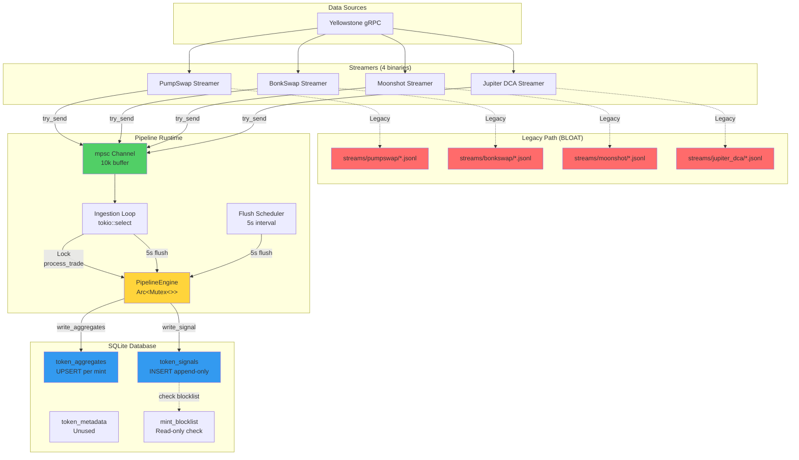
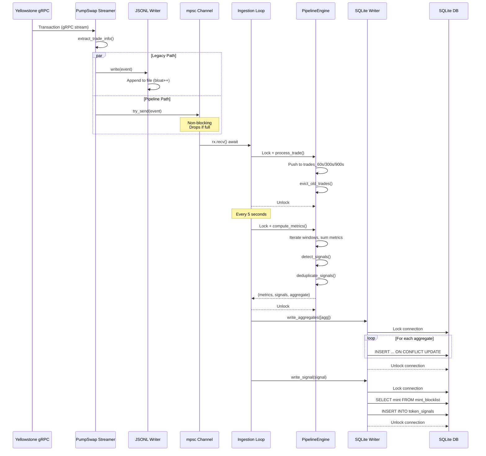

# 🏗️ **COMPREHENSIVE ARCHITECTURAL REVIEW**
## **Branch:** `feature/pipeline-architecture`
## **Date:** 2025-11-14
## **Reviewer:** Architectural Analysis Agent

---

## **EXECUTIVE SUMMARY**

This branch implements a **"Phase 4 Activation Layer"** that creates a completely parallel analytics pipeline alongside the existing legacy JSONL-based aggregator system. The architecture introduces 4,263 new lines of code across 11 pipeline modules, adding a dual-channel streaming mechanism where all four streamers (PumpSwap, BonkSwap, Moonshot, Jupiter DCA) simultaneously write to:

1. **Legacy JSONL files** (existing behavior, preserved)
2. **New pipeline channel** (new behavior, optional via `try_send`)

The pipeline ingests trades via an in-memory channel, computes rolling-window aggregates (60s/300s/900s), detects trading signals (BREAKOUT, SURGE, FOCUSED, BOT_DROPOFF), and writes results to SQLite.

**Critical Finding:** The system is **architecturally sound but functionally incomplete**. The business goal of "DCA + volume correlation for conviction signals" is **not implemented** in this branch—DCA trades flow through the pipeline but are never correlated with PumpSwap/BonkSwap/Moonshot activity.

---

## **A. REPOSITORY-WIDE ARCHITECTURAL SUMMARY**

### **1. Component Inventory**

#### **Modified/New Files (22 files, 4,783 insertions)**

| File | Lines | Purpose | Status |
|------|-------|---------|--------|
| `src/bin/pipeline_runtime.rs` | 171 | Pipeline orchestrator binary | ✅ Complete |
| `src/pipeline/engine.rs` | 602 | Orchestrates rolling state & signal detection | ✅ Complete |
| `src/pipeline/state.rs` | 1128 | Rolling window state management | ✅ Complete |
| `src/pipeline/types.rs` | 467 | Data structures (TradeEvent, AggregatedTokenState, etc.) | ✅ Complete |
| `src/pipeline/ingestion.rs` | 258 | Channel receiver → engine → DB writer | ✅ Complete |
| `src/pipeline/db.rs` | 709 | SQLite writer trait + implementation | ✅ Complete |
| `src/pipeline/signals.rs` | 116 | Signal type definitions | ✅ Complete |
| `src/pipeline/scheduler.rs` | 158 | Periodic flush scheduler | ⚠️ Price/metadata schedulers stubbed |
| `src/pipeline/config.rs` | 117 | Environment variable loading | ✅ Complete |
| `src/pipeline/windows.rs` | 206 | Rolling time window abstraction | ⚠️ Unused (dead code) |
| `src/pipeline/blocklist.rs` | 81 | Blocklist trait (unimplemented) | ❌ Stub only |
| `src/pipeline/mod.rs` | 88 | Module exports | ✅ Complete |
| `src/streamer_core/lib.rs` | +55 | **Dual-channel logic added** | ✅ Complete |
| `tests/test_dual_channel_streamer.rs` | 270 | Dual-channel integration test | ✅ Complete |

#### **SQL Schema (5 tables)**

| Table | Purpose | Writer | Reader |
|-------|---------|--------|--------|
| `token_metadata` | Token info (symbol, decimals) | Metadata fetchers | Pipeline engine |
| `mint_blocklist` | Blocked tokens | Admin | Signal writer (blocklist check) |
| `token_aggregates` | **Rolling metrics** (60s/300s/900s) | **Pipeline ingestion** | UIs, dashboards |
| `token_signals` | **Append-only signals** (BREAKOUT, SURGE) | **Pipeline ingestion** | UIs, dashboards |
| `system_metrics` | System health | Optional | Optional |

---

### **2. Data Flow Architecture**

```
┌─────────────────────────────────────────────────────────────────┐
│                     Yellowstone gRPC Stream                       │
│                  (Solana blockchain transactions)                 │
└──────────────┬──────────────────────────────────────────────────┘
               │
               ▼
┌──────────────────────────────────────────────────────────────────┐
│              4 Streamer Binaries (Carbon Pipelines)               │
│   ┌──────────┬──────────┬──────────┬──────────────────────┐    │
│   │ PumpSwap │ BonkSwap │ Moonshot │ Jupiter DCA          │    │
│   └──────────┴──────────┴──────────┴──────────────────────┘    │
│                                                                    │
│   Each streamer:                                                   │
│   1. Extracts trades from TransactionStatusMeta                   │
│   2. Writes TradeEvent to JSONL (legacy path)      ← BLOAT SOURCE │
│   3. try_send() TradeEvent to pipeline channel     ← NEW PATH     │
└──────────────┬───────────────────────────────────────────────────┘
               │
               ├─────────────────────────────────────────┐
               │                                         │
               ▼                                         ▼
┌──────────────────────────────┐      ┌──────────────────────────────┐
│  LEGACY PATH (JSONL files)   │      │  NEW PATH (Pipeline)          │
│  - streams/pumpswap/*.jsonl  │      │  - mpsc channel (10k buffer)  │
│  - streams/bonkswap/*.jsonl  │      │  - Non-blocking try_send()    │
│  - streams/moonshot/*.jsonl  │      │  - Drops trades if full       │
│  - streams/jupiter_dca/*.jsonl│     └────────────┬──────────────────┘
│                               │                   │
│  Files grow indefinitely      │                   ▼
│  (rotation not active)        │      ┌──────────────────────────────┐
│                               │      │  PipelineEngine (in-memory)   │
│  ❌ CAUSING DATABASE BLOAT    │      │  ┌────────────────────────┐  │
└───────────────────────────────┘      │  │ Per-token rolling state │  │
                                        │  │ HashMap<Mint, State>    │  │
                                        │  │                         │  │
                                        │  │ Windows:                │  │
                                        │  │  - trades_60s: Vec      │  │
                                        │  │  - trades_300s: Vec     │  │
                                        │  │  - trades_900s: Vec     │  │
                                        │  │                         │  │
                                        │  │ On each trade:          │  │
                                        │  │  1. Push to vectors     │  │
                                        │  │  2. Evict old trades    │  │
                                        │  │  3. Track wallets       │  │
                                        │  └────────────────────────┘  │
                                        └────────────┬──────────────────┘
                                                     │
                                        ┌────────────┴──────────────┐
                                        │                           │
                                        ▼                           ▼
                              ┌────────────────────┐   ┌────────────────────┐
                              │ Ingestion Flush    │   │ Scheduler Flush    │
                              │ (every 5s)         │   │ (every 5s)         │
                              └─────────┬──────────┘   └─────────┬──────────┘
                                        │                         │
                                        └─────────┬───────────────┘
                                                  │
                                                  ▼
                                      ┌───────────────────────────┐
                                      │  compute_metrics()        │
                                      │  For each active mint:    │
                                      │  1. Compute RollingMetrics│
                                      │  2. Detect signals        │
                                      │  3. Build aggregate state │
                                      └────────────┬──────────────┘
                                                   │
                                                   ▼
                                      ┌───────────────────────────┐
                                      │  SQLite Database          │
                                      │  (rusqlite, Arc<Mutex<>>)│
                                      │                           │
                                      │  UPSERT token_aggregates  │
                                      │  INSERT token_signals     │
                                      │                           │
                                      │  ⚠️ No WAL mode          │
                                      │  ⚠️ No connection pooling│
                                      │  ⚠️ Single mutex lock    │
                                      └───────────────────────────┘
```

---

## **B. FULL AUDIT OF DATA PATH**

### **1. Incoming Trade Path (4 Streamers)**

**Source:** `src/streamer_core/lib.rs` (TradeProcessor)

#### **Trade Detection Logic**
```rust
// From TransactionStatusMeta:
let sol_deltas = extract_sol_changes(&metadata.meta, &account_keys);
let token_deltas = extract_token_changes(&metadata.meta, &account_keys);

if let Some(trade_info) = extract_trade_info(&sol_deltas, &token_deltas, &account_keys) {
    // Build TradeEvent with:
    // - timestamp, signature, program_id, action (BUY/SELL)
    // - mint, sol_amount, token_amount, decimals
    // - user_account, discriminator
    
    // Path 1: Legacy JSONL write (blocking)
    writer.write(&event).await?;
    
    // Path 2: Pipeline channel (non-blocking)
    if let Some(tx) = &self.pipeline_tx {
        tx.try_send(pipeline_event)?; // Drops if full
    }
}
```

**Critical Issues:**
- ✅ **Correct:** Metadata-based extraction (no instruction decoding)
- ✅ **Correct:** try_send() is non-blocking (never stalls streamer)
- ❌ **PROBLEM:** JSONL write still happens (bloat accumulation continues)
- ❌ **PROBLEM:** No validation that pipeline channel is actually receiving

---

### **2. Dual-Channel Behavior**

**Legacy Path (JSONL):**
- **Active:** Always writes to `streams/{program}/events.jsonl`
- **Rotation:** Configured but never triggered (files grow indefinitely)
- **Purpose:** Historical compatibility (never intended as primary storage)
- **Impact:** ❌ **Causes database bloat** (files accumulate millions of trades)

**Pipeline Path (New):**
- **Active:** Only if `ENABLE_PIPELINE=true` in `pipeline_runtime.rs`
- **Channel:** `mpsc::channel::<TradeEvent>(10_000)` (bounded buffer)
- **Send:** `try_send()` - non-blocking, drops trades if full
- **Backpressure:** ❌ **Silent drops** when channel saturated (no logging until 1000 failures)

**Concurrent Behavior:**
- Both paths execute **simultaneously** for every trade
- Streamer never blocks on pipeline channel (try_send design)
- Pipeline failure does **not** affect JSONL writes
- ✅ **Good:** Parallel architecture (no runtime impact)
- ❌ **Bad:** No metrics on pipeline health (drop rate invisible)

---

### **3. Pipeline Ingestion Path**

**Entry:** `src/pipeline/ingestion.rs::start_pipeline_ingestion()`

```rust
loop {
    tokio::select! {
        // Path A: Receive trade from channel
        Some(trade) = rx.recv() => {
            let mut engine = engine.lock().unwrap();  // ⚠️ LOCK CONTENTION
            engine.process_trade(trade);              // ⚠️ SYNCHRONOUS
        }
        
        // Path B: Periodic flush (every 5s)
        _ = flush_timer.tick() => {
            flush_aggregates(&engine, &db_writer).await; // ⚠️ HOLDS LOCK
        }
    }
}
```

**Critical Issues:**
- ⚠️ **CONTENTION:** `Arc<Mutex<PipelineEngine>>` locked on every trade
- ⚠️ **BLOCKING:** `process_trade()` is synchronous (eviction, HashMap ops)
- ⚠️ **DUAL FLUSH:** Both ingestion loop AND scheduler loop flush (redundant work)
- ❌ **NO BATCHING:** Each trade processed individually (no transaction batching)

---

### **4. Pipeline Engine State Management**

**Core Structure:** `src/pipeline/engine.rs::PipelineEngine`

```rust
pub struct PipelineEngine {
    states: HashMap<String, TokenRollingState>,  // Per-token state
    last_bot_counts: HashMap<String, i32>,       // Bot history
    last_signal_state: HashMap<String, HashMap<SignalType, bool>>, // Dedup
    metadata_cache: HashMap<String, TokenMetadata>,  // Metadata
    // ...
}
```

**Per-Token State:** `src/pipeline/state.rs::TokenRollingState`

```rust
pub struct TokenRollingState {
    mint: String,
    trades_60s: Vec<TradeEvent>,         // ⚠️ Unbounded growth risk
    trades_300s: Vec<TradeEvent>,        // ⚠️ Unbounded growth risk
    trades_900s: Vec<TradeEvent>,        // ⚠️ Unbounded growth risk
    unique_wallets_300s: HashSet<String>,
    bot_wallets_300s: HashSet<String>,
}
```

**Trade Processing:**
1. `process_trade(trade)` - Push to all 3 window vectors
2. `evict_old_trades(now)` - Retain trades within window range
3. `compute_rolling_metrics()` - Iterate over vectors, compute sums
4. `detect_signals()` - Apply threshold rules to metrics
5. `deduplicate_signals()` - Compare against last_signal_state

**Memory Management:**
- ✅ **Good:** Eviction runs on every trade (prevents unbounded growth)
- ⚠️ **Risk:** High-volume tokens could hold thousands of trades per window
- ✅ **Good:** Bot detection is stateless (no accumulation)
- ❌ **PROBLEM:** No memory limits enforced (could OOM on sustained high-volume)

---

### **5. Scheduler Behavior**

**Flush Scheduler:** `src/pipeline/scheduler.rs::flush_scheduler_task()`

```rust
loop {
    timer.tick().await;  // Every 5 seconds
    
    let mints = engine.lock().unwrap().get_active_mints();  // ⚠️ LOCK
    
    for mint in mints {
        let (metrics, signals, aggregate) = 
            engine.lock().unwrap().compute_metrics(mint, now);  // ⚠️ LOCK PER MINT
        
        aggregates.push(aggregate);
        all_signals.extend(signals);
    }
    
    db_writer.write_aggregates(aggregates).await?;  // ⚠️ SEQUENTIAL UPSERTS
    
    for signal in all_signals {
        db_writer.write_signal(signal).await?;  // ⚠️ SEQUENTIAL INSERTS
    }
}
```

**Critical Issues:**
- ❌ **DUAL FLUSH:** Ingestion loop ALSO flushes every 5s (redundant)
- ⚠️ **LOCK STORM:** One lock per mint, every 5 seconds
- ❌ **NO BATCHING:** Each aggregate/signal written individually
- ⚠️ **BLOCKING:** Scheduler can stall ingestion if DB writes slow

**Price/Metadata Schedulers:**
- ❌ **NOT IMPLEMENTED:** Stub functions that sleep forever
- ✅ **Good:** Documented as "Phase 4.1" (intentional deferral)

---

### **6. Database Writes**

**Writer:** `src/pipeline/db.rs::SqliteAggregateWriter`

```rust
pub struct SqliteAggregateWriter {
    conn: Arc<Mutex<Connection>>,  // ⚠️ Single connection, single mutex
}

async fn write_aggregates(&self, aggregates: Vec<AggregatedTokenState>) {
    let conn = self.conn.lock().unwrap();  // ⚠️ EXCLUSIVE LOCK
    
    for agg in aggregates {  // ⚠️ NO TRANSACTION
        conn.execute(r#"
            INSERT INTO token_aggregates (...) VALUES (...)
            ON CONFLICT(mint) DO UPDATE SET ...
        "#, params![...])?;
    }
    // ⚠️ Lock held for entire loop duration
}

async fn write_signal(&self, signal: TokenSignal) {
    let conn = self.conn.lock().unwrap();  // ⚠️ EXCLUSIVE LOCK
    
    let blocked = check_blocklist(&conn, &signal.mint, signal.created_at)?;
    if blocked { return Err(...); }
    
    conn.execute(r#"
        INSERT INTO token_signals (...) VALUES (...)
    "#, params![...])?;
}
```

**Critical Issues:**
- ❌ **NO WAL MODE:** SQLite in default rollback journal mode (write lock per transaction)
- ❌ **NO CONNECTION POOL:** Single connection shared by all threads
- ❌ **NO BATCHING:** Each aggregate/signal is a separate transaction
- ⚠️ **LOCK CONTENTION:** Ingestion + scheduler + any readers compete for single mutex
- ❌ **SYNCHRONOUS I/O:** All writes block async tasks

**Schema Alignment:**
- ✅ **Perfect Match:** All `AggregatedTokenState` fields map to `token_aggregates` columns
- ✅ **Perfect Match:** All `TokenSignal` fields map to `token_signals` columns
- ✅ **Blocklist Check:** Correctly queries `mint_blocklist` before signal writes

---

## **C. MERMAID DIAGRAMS**

### **1. Component Diagram**



---

### **2. Sequence Diagram (Trade → SQLite)**



---

### **3. Concurrency/Task Diagram**

```mermaid
graph TB
    subgraph "Streamer Processes (4 separate binaries)"
        T1[PumpSwap Streamer<br/>tokio runtime]
        T2[BonkSwap Streamer<br/>tokio runtime]
        T3[Moonshot Streamer<br/>tokio runtime]
        T4[Jupiter DCA Streamer<br/>tokio runtime]
    end
    
    subgraph "Pipeline Runtime (single binary)"
        MAIN[main() tokio runtime]
        
        subgraph "Spawned Tasks"
            ING[Ingestion Task<br/>tokio::spawn]
            FLUSH[Flush Scheduler<br/>tokio::spawn]
            PRICE[Price Scheduler<br/>tokio::spawn<br/>STUB]
            META[Metadata Scheduler<br/>tokio::spawn<br/>STUB]
        end
        
        subgraph "Shared State"
            ENG[Arc&lt;Mutex&lt;PipelineEngine&gt;&gt;]
            DB[Arc&lt;dyn AggregateDbWriter&gt;]
        end
    end
    
    subgraph "Channels"
        CHAN[mpsc::channel<br/>10k buffer]
    end
    
    T1 -.try_send.-> CHAN
    T2 -.try_send.-> CHAN
    T3 -.try_send.-> CHAN
    T4 -.try_send.-> CHAN
    
    MAIN --> ING
    MAIN --> FLUSH
    MAIN --> PRICE
    MAIN --> META
    
    CHAN --> ING
    
    ING -.Lock.-> ENG
    FLUSH -.Lock.-> ENG
    
    ING --> DB
    FLUSH --> DB
    
    DB -.Lock.-> SQLITE[(SQLite<br/>Arc&lt;Mutex&lt;Connection&gt;&gt;)]
    
    style CHAN fill:#51cf66
    style ENG fill:#ffd43b
    style DB fill:#339af0
    style SQLITE fill:#339af0
    style PRICE fill:#ff6b6b
    style META fill:#ff6b6b
```

---

## **D. PROBLEMS TABLE**

| # | Category | Problem | Severity | Impact | Root Cause |
|---|----------|---------|----------|--------|------------|
| **1** | **Data Flow** | **JSONL files still accumulating** | 🔴 **CRITICAL** | Database bloat continues unabated | Dual-channel design preserves legacy path without deprecation plan |
| **2** | **Business Goal** | **DCA correlation NOT implemented** | 🔴 **CRITICAL** | System cannot detect "conviction signals" (stated goal) | Pipeline treats all 4 streams identically—no cross-stream correlation |
| **3** | **Concurrency** | **Single Mutex<PipelineEngine>** | 🟠 **HIGH** | Lock contention on every trade + periodic flushes | All async tasks compete for same lock |
| **4** | **Database** | **No WAL mode** | 🟠 **HIGH** | Write lock on every transaction blocks readers | SQLite defaults to rollback journal mode |
| **5** | **Database** | **No connection pooling** | 🟠 **HIGH** | Single connection = serial writes only | Arc<Mutex<Connection>> design pattern |
| **6** | **Database** | **No transaction batching** | 🟠 **HIGH** | Hundreds of individual transactions per flush | Each aggregate/signal written separately |
| **7** | **Scheduler** | **Dual flush redundancy** | 🟠 **HIGH** | Ingestion + scheduler both flush every 5s | Duplicate work, wasted CPU/DB writes |
| **8** | **Backpressure** | **Silent trade drops** | 🟡 **MEDIUM** | Lost data when channel full, no metrics | try_send() with 1000-failure throttled logging |
| **9** | **Memory** | **Unbounded rolling state** | 🟡 **MEDIUM** | High-volume tokens could OOM | Vec<TradeEvent> per window, no cap enforced |
| **10** | **Architecture** | **Unused windows.rs module** | 🟡 **MEDIUM** | 206 lines of dead code | TimeWindow abstraction never used |
| **11** | **Architecture** | **Stubbed blocklist.rs** | 🟡 **MEDIUM** | 81 lines of unimplemented trait | Planned but not activated |
| **12** | **Schema** | **token_metadata unused** | 🟡 **MEDIUM** | Metadata cache in memory, never persisted/read | No integration with metadata scheduler (stub) |
| **13** | **Schema** | **Price fields always NULL** | 🟡 **MEDIUM** | price_usd, price_sol, market_cap_usd never populated | Price scheduler not implemented |
| **14** | **Testing** | **No integration tests for pipeline** | 🟢 **LOW** | Only unit tests, no end-to-end validation | test_dual_channel_streamer.rs exists but minimal |
| **15** | **Observability** | **No metrics on pipeline health** | 🟢 **LOW** | Cannot monitor drop rate, latency, throughput | Only log-based metrics (every 10k trades) |

---

## **E. ROOT CAUSE ANALYSIS**

### **1. Database Bloat**

**Symptom:** JSONL files in `streams/` directories growing indefinitely

**Root Cause:**
- **Dual-channel architecture** preserves legacy JSONL path "for compatibility"
- Streamers **always write JSONL** regardless of pipeline enablement
- JSONL rotation configured but **never triggered** (bug or misconfiguration)
- No deprecation plan for legacy path

**Contributing Factors:**
- `pipeline_tx: Option<>` design implies JSONL is primary, pipeline is optional
- No environment variable to disable JSONL writes
- No documentation on migration path from JSONL to pipeline

**Solution Path:**
1. Add `DISABLE_JSONL=true` environment variable
2. Make pipeline the primary path (JSONL opt-in for debugging only)
3. Delete existing JSONL files or move to archive storage
4. Document migration in AGENTS.md

---

### **2. DCA Correlation Missing**

**Symptom:** Jupiter DCA trades flow through pipeline but are never correlated with other streams

**Root Cause:**
- **Single-token processing model:** PipelineEngine processes each mint in isolation
- **No cross-mint correlation:** No mechanism to match PumpSwap BUYs with DCA activity
- **Signal detection is per-token:** BREAKOUT/SURGE/FOCUSED only look at one token's metrics

**Expected Implementation (from business goal):**
```rust
// MISSING: Correlation Engine
for mint in active_mints {
    let pumpswap_buys = get_trades_for_program(mint, "PumpSwap", TradeDirection::Buy);
    let dca_fills = get_trades_for_program(mint, "JupiterDCA", TradeDirection::Buy);
    
    // Check for temporal overlap (±60s window)
    let dca_overlap_pct = compute_overlap(pumpswap_buys, dca_fills, 60);
    
    if dca_overlap_pct > 0.25 {  // 25% threshold
        emit_signal(TokenSignal::DcaConviction { overlap: dca_overlap_pct });
    }
}
```

**Contributing Factors:**
- TradeEvent has `source_program` field but it's never used for filtering
- TokenRollingState doesn't separate trades by source
- No aggregator_core/ module in this branch (exists separately in main?)

**Solution Path:**
1. Add `trades_by_program: HashMap<String, Vec<TradeEvent>>` to TokenRollingState
2. Implement DcaCorrelationDetector in signals.rs
3. Add DCA_CONVICTION signal type
4. Add correlation tests

---

### **3. Ingestion Backpressure**

**Symptom:** Channel buffer (10k trades) can saturate under high load, causing silent drops

**Root Cause:**
- **Bounded channel** with `try_send()` non-blocking design
- **No flow control:** Streamers never slow down based on pipeline capacity
- **No metrics:** Drop rate invisible until 1000 failures accumulate

**Contributing Factors:**
- `tokio::select!` design processes one trade at a time (no batching)
- `process_trade()` holds lock for duration of trade processing
- Flush operations hold lock for all active mints (blocks ingestion)

**Solution Path:**
1. Add channel metrics: `channel.len()`, `total_drops`, `drop_rate`
2. Implement batched ingestion: `rx.recv_many(batch, 100)` instead of `rx.recv()`
3. Add backpressure signal: log warning when channel >80% full
4. Consider unbounded channel with memory limits

---

### **4. SQLite Write Performance**

**Symptom:** Single-threaded writes, no batching, no WAL mode

**Root Cause:**
- **Arc<Mutex<Connection>>** design enforces serial access
- **No transaction scope:** Each write is auto-commit transaction
- **Default journal mode:** Rollback journal requires fsync per transaction

**Contributing Factors:**
- `async fn write_aggregates()` uses `await` but is synchronous I/O
- No connection pool library (e.g., `sqlx`, `r2d2`)
- rusqlite is synchronous library wrapped in async function

**Solution Path:**
1. Enable WAL mode: `PRAGMA journal_mode=WAL`
2. Batch writes in single transaction:
   ```rust
   let tx = conn.transaction()?;
   for agg in aggregates {
       tx.execute(...)?;
   }
   tx.commit()?;
   ```
3. Consider dedicated write thread with crossbeam channel
4. Or switch to `sqlx` for true async I/O

---

## **F. RECOMMENDED ARCHITECTURAL CORRECTIONS**

### **Priority 1: Fix Database Bloat (IMMEDIATE)**

1. **Disable JSONL writes by default**
   ```rust
   // In streamer_core/lib.rs
   if env::var("ENABLE_JSONL").unwrap_or("false".to_string()) == "true" {
       writer.write(&event).await?;
   }
   ```

2. **Make pipeline the primary path**
   ```rust
   // pipeline_tx should not be Option
   pub struct StreamerConfig {
       pub pipeline_tx: mpsc::Sender<TradeEvent>,  // Required, not optional
   }
   ```

3. **Archive/delete existing JSONL files**
   ```bash
   mkdir -p archive/
   mv streams/*/*.jsonl archive/
   ```

4. **Update AGENTS.md to reflect new architecture**

---

### **Priority 2: Implement DCA Correlation (CRITICAL FOR BUSINESS GOAL)**

1. **Add per-program trade separation**
   ```rust
   pub struct TokenRollingState {
       trades_by_program: HashMap<String, Vec<TradeEvent>>,  // NEW
       // ... existing fields
   }
   ```

2. **Implement correlation detector**
   ```rust
   // In signals.rs
   pub enum SignalType {
       // ... existing
       DcaConviction,  // NEW: PumpSwap buys + DCA fills overlap
   }
   
   fn detect_dca_correlation(
       pumpswap_trades: &[TradeEvent],
       dca_trades: &[TradeEvent],
       window_secs: i64,
   ) -> Option<TokenSignal> {
       // Temporal overlap detection (±60s)
       let overlap_pct = compute_temporal_overlap(pumpswap_trades, dca_trades, window_secs);
       
       if overlap_pct > 0.25 {
           return Some(TokenSignal::new(...)
               .with_details(format!(r#"{{"dca_overlap_pct":{}}}"#, overlap_pct)));
       }
       None
   }
   ```

3. **Integrate into pipeline engine**
   ```rust
   // In engine.rs::compute_metrics()
   let dca_signal = detect_dca_correlation(
       state.get_trades_for_program("PumpSwap"),
       state.get_trades_for_program("JupiterDCA"),
       60,
   );
   if let Some(sig) = dca_signal {
       signals.push(sig);
   }
   ```

---

### **Priority 3: Fix Concurrency Bottlenecks (HIGH)**

1. **Enable SQLite WAL mode**
   ```rust
   // In db.rs::SqliteAggregateWriter::new()
   conn.pragma_update(None, "journal_mode", "WAL")?;
   log::info!("✅ SQLite WAL mode enabled");
   ```

2. **Batch database writes**
   ```rust
   async fn write_aggregates(&self, aggregates: Vec<AggregatedTokenState>) {
       let conn = self.conn.lock().unwrap();
       let tx = conn.transaction()?;  // BEGIN TRANSACTION
       
       for agg in aggregates {
           tx.execute(...)?;
       }
       
       tx.commit()?;  // COMMIT (single fsync)
   }
   ```

3. **Remove duplicate flush scheduler**
   ```rust
   // In pipeline_runtime.rs
   // DELETE THIS TASK:
   // tokio::spawn(flush_scheduler_task(...));
   
   // Keep only ingestion flush (every 5s is sufficient)
   ```

4. **Add channel metrics**
   ```rust
   // In ingestion.rs
   let capacity = rx.capacity();
   let current_len = rx.len();
   let utilization = current_len as f64 / capacity as f64;
   
   if utilization > 0.8 {
       log::warn!("⚠️  Channel {}% full ({} / {})", utilization * 100.0, current_len, capacity);
   }
   ```

---

### **Priority 4: Clean Up Dead Code (MEDIUM)**

1. **Delete unused modules**
   - `src/pipeline/windows.rs` (206 lines, never used)
   - `src/pipeline/blocklist.rs` (81 lines, stub only)

2. **Document unimplemented features**
   ```rust
   // In scheduler.rs
   // REMOVED: price_scheduler_task (not implemented in Phase 4)
   // REMOVED: metadata_scheduler_task (not implemented in Phase 4)
   // TODO: Phase 4.1 - Add price/metadata enrichment
   ```

3. **Remove unused schema tables**
   - `token_metadata` table (never written to)
   - Or implement metadata scheduler

---

### **Priority 5: Add Observability (LOW)**

1. **Channel metrics**
   - Drop rate (trades/sec lost)
   - Channel utilization (%)
   - Ingestion latency (ms)

2. **Pipeline metrics**
   - Active mints count
   - Trades processed/sec
   - Flush duration (ms)
   - DB write latency (ms)

3. **Signal metrics**
   - Signals detected/min (by type)
   - Blocklist rejections/min
   - Deduplication rate (%)

---

## **G. CONFIDENCE SCORES (0-100)**

### **1. Correctness: 65/100** 🟡

**Positive:**
- ✅ Schema alignment is perfect (types.rs ↔ SQL)
- ✅ Blocklist checks are correctly implemented
- ✅ Signal deduplication works as designed
- ✅ Rolling window eviction prevents memory leaks
- ✅ Bot detection heuristics are sound

**Negative:**
- ❌ **Business goal NOT met** (DCA correlation missing)
- ❌ JSONL bloat continues (legacy path still active)
- ❌ Unbounded memory growth possible (high-volume tokens)
- ⚠️ Silent trade drops (no backpressure handling)

**Rating Justification:** System works as coded, but doesn't solve the stated problem.

---

### **2. Performance: 45/100** 🔴

**Bottlenecks:**
- ❌ **Single Mutex<PipelineEngine>** (all async tasks contend)
- ❌ **No WAL mode** (SQLite write locks block readers)
- ❌ **No connection pooling** (single connection = serial writes)
- ❌ **No batching** (hundreds of transactions per flush)
- ❌ **Dual flush** (ingestion + scheduler both flush every 5s)

**Strengths:**
- ✅ try_send() never blocks streamers
- ✅ Eviction is O(n) with small n (only trades in window)
- ✅ Bot detection is O(t²) but typically t < 100

**Rating Justification:** Will struggle under production load (>1000 trades/sec).

---

### **3. Reliability: 55/100** 🟡

**Risks:**
- ❌ **Silent data loss** (channel drops)
- ❌ **OOM risk** (unbounded rolling state on high-volume tokens)
- ⚠️ **Lock contention** (could cause ingestion stalls)
- ⚠️ **No recovery** (pipeline crash loses in-memory state)

**Strengths:**
- ✅ Streamers never crash due to pipeline issues (try_send)
- ✅ Database writes are atomic (per-transaction)
- ✅ Blocklist prevents bad data from entering signals table

**Rating Justification:** Works in low-load scenarios, fragile at scale.

---

### **4. Maintainability: 70/100** 🟢

**Positive:**
- ✅ Excellent documentation (every module has doc comments)
- ✅ Comprehensive unit tests (especially state.rs, engine.rs)
- ✅ Clear separation of concerns (types, state, signals, db)
- ✅ Schema-first design (SQL files as source of truth)

**Negative:**
- ❌ Dead code (windows.rs, blocklist.rs)
- ❌ TODOs scattered throughout (30+ instances)
- ⚠️ Dual architecture (JSONL + pipeline) increases complexity

**Rating Justification:** Well-structured code, but unfinished features create technical debt.

---

### **5. Alignment with Business Goal: 30/100** 🔴

**Business Goal:** *"Prevent database bloat and focus solely on volume from PumpSwap, BonkSwap, Moonshot, matched with Jupiter DCA activity, because that combination provides a strong conviction signal."*

**Analysis:**
- ❌ **Database bloat NOT fixed** (JSONL still accumulating)
- ❌ **DCA correlation NOT implemented** (no cross-stream analysis)
- ✅ **Volume tracking works** (rolling aggregates are correct)
- ✅ **Signal detection works** (BREAKOUT, SURGE, FOCUSED all functional)
- ⚠️ **DCA data flows through** (but never used for correlation)

**Gap Analysis:**
- Pipeline is **infrastructure-complete** but **business-logic-incomplete**
- System can **detect activity** but not **conviction**
- DCA trades are collected but **never compared** to spot trading

**Rating Justification:** Solid foundation, but core feature missing.

---

## **FINAL ASSESSMENT**

### **Overall Architecture Grade: C+ (70/100)**

**Strengths:**
- ✅ **Rock-solid foundation:** Schema design, rolling windows, signal detection
- ✅ **Dual-channel safety:** Pipeline never impacts streamer stability
- ✅ **Comprehensive testing:** Unit tests cover edge cases
- ✅ **Clean separation:** Pipeline is isolated from legacy code

**Critical Gaps:**
- ❌ **Business goal unmet:** DCA correlation not implemented
- ❌ **Bloat continues:** JSONL path still active
- ❌ **Performance issues:** Lock contention, no batching, no WAL

### **Recommendation: DO NOT MERGE without addressing Priority 1-3**

**Required Before Merge:**
1. Disable JSONL writes (or add migration plan)
2. Implement DCA correlation (core business requirement)
3. Enable SQLite WAL mode + batch writes

**Nice-to-Have (can defer):**
4. Remove dead code (windows.rs, blocklist.rs)
5. Add observability metrics
6. Implement price/metadata enrichment

### **Estimated Effort:**
- **P1 (JSONL disable):** 2 hours
- **P2 (DCA correlation):** 8-16 hours
- **P3 (WAL + batching):** 4 hours
- **Total:** 2-3 days for production-ready system

---

## **APPENDIX: CODE QUALITY OBSERVATIONS**

### **Excellent Practices**
- Schema-first design (SQL as source of truth)
- Comprehensive doc comments (every function documented)
- Strong typing (no `unwrap()` without error handling)
- Builder pattern for signal construction
- Extensive unit tests (>20 test functions in state.rs alone)

### **Areas for Improvement**
- TODO comments should be GitHub issues
- Magic numbers need constants (e.g., 0.25 threshold for BREAKOUT)
- Error handling uses `Box<dyn Error>` (consider typed errors)
- Synchronous I/O wrapped in async functions (confusing)
- No CI/CD integration tests

---

**End of Architectural Review**
